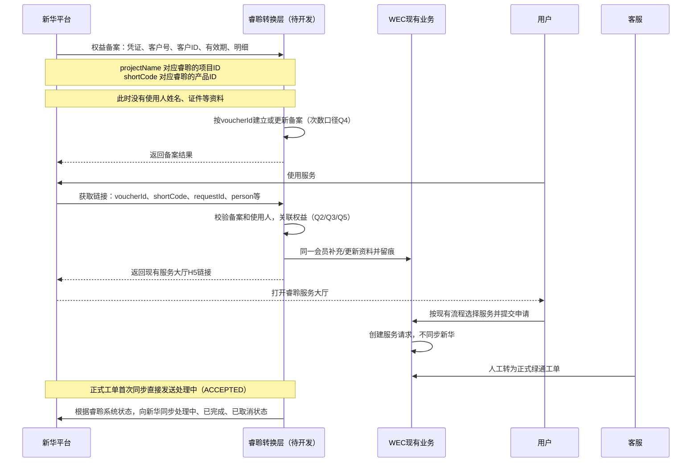
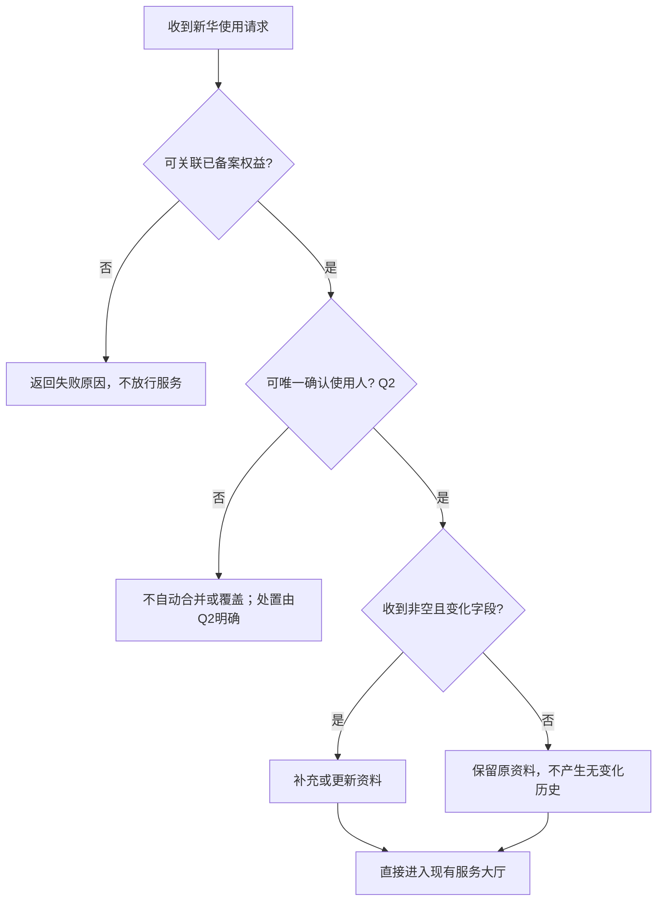
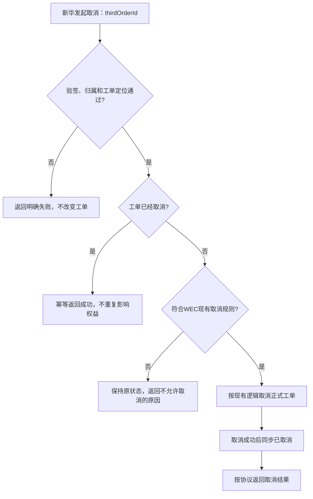

# 新华与睿聆业务流程图

## 1. 三方业务过程

```mermaid
sequenceDiagram
    participant X as 新华平台
    participant A as 睿聆转换层（待开发）
    participant W as WEC现有业务
    participant U as 用户
    participant O as 客服
    X->>A: 权益备案：凭证、客户号、客户ID、有效期、明细
    Note over X,A: projectName 对应睿聆的项目ID<br/>shortCode 对应睿聆的产品ID
    Note over X,A: 此时没有使用人姓名、证件等资料
    A->>A: 按voucherId建立或更新备案（次数口径Q4）
    A-->>X: 返回备案结果
    U->>X: 使用服务
    X->>A: 获取链接：voucherId、shortCode、requestId、person等
    A->>A: 校验备案和使用人，关联权益（Q2/Q3/Q5）
    A->>W: 同一会员补充/更新资料并留痕
    A-->>X: 返回现有服务大厅H5链接
    X-->>U: 打开睿聆服务大厅
    U->>W: 按现有流程选择服务并提交申请
    W->>W: 创建服务请求，不同步新华
    O->>W: 人工转为正式绿通工单
    Note over A,X: 正式工单首次同步直接发送处理中（ACCEPTED）
    A->>X: 根据睿聆系统状态，向新华同步处理中、已完成、已取消状态
```

## 2. 使用人资料补充

```mermaid
flowchart TD
    A[收到新华使用请求] --> B{可关联已备案权益?}
    B -- 否 --> C[返回失败原因，不放行服务]
    B -- 是 --> D{可唯一确认使用人? Q2}
    D -- 否 --> E[不自动合并或覆盖；处置由Q2明确]
    D -- 是 --> F{收到非空且变化字段?}
    F -- 否 --> G[保留原资料，不产生无变化历史]
    F -- 是 --> H[补充或更新资料]
    H --> I[直接进入现有服务大厅]
    G --> I
```

## 3. 新华取消正式工单

```mermaid
flowchart TD
    A[新华发起取消：thirdOrderId] --> B{验签、归属和工单定位通过?}
    B -- 否 --> C[返回明确失败，不改变工单]
    B -- 是 --> D{工单已经取消?}
    D -- 是 --> E[幂等返回成功，不重复影响权益]
    D -- 否 --> F{符合WEC现有取消规则?}
    F -- 否 --> G[保持原状态，返回不允许取消的原因]
    F -- 是 --> H[按现有逻辑取消正式工单]
    H --> I[取消成功后同步已取消]
    I --> J[按协议返回取消结果]
```

取消服务单不是退保，不取消整个权益凭证。图中的状态同步失败重试不代表要撤销已成功的本地取消，具体一致性和补偿由研发设计。
